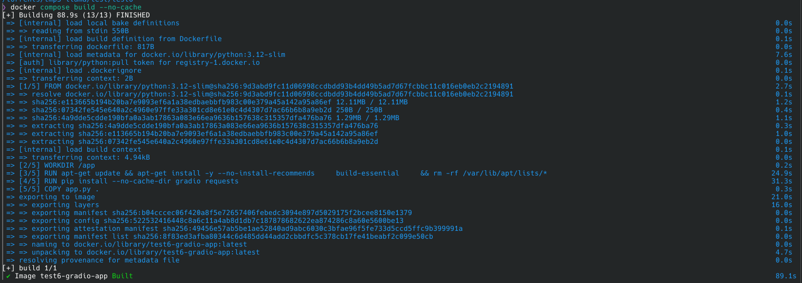
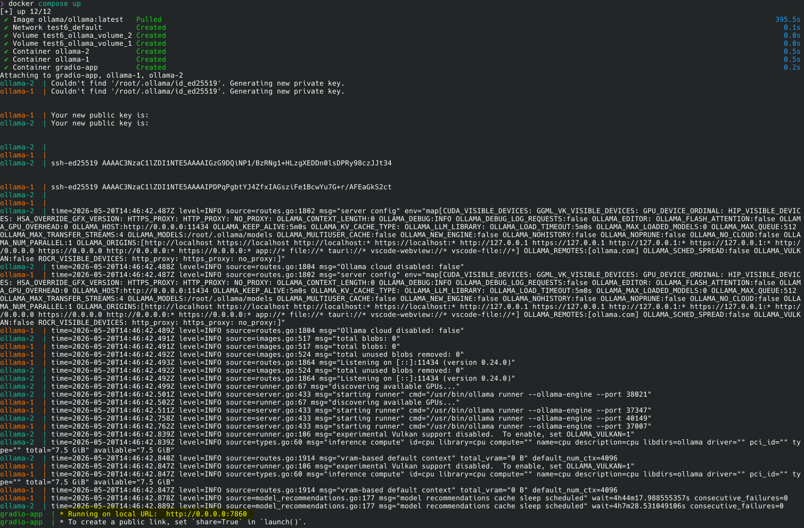
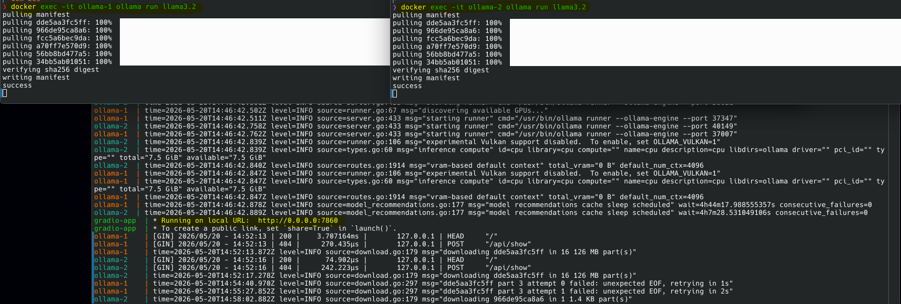
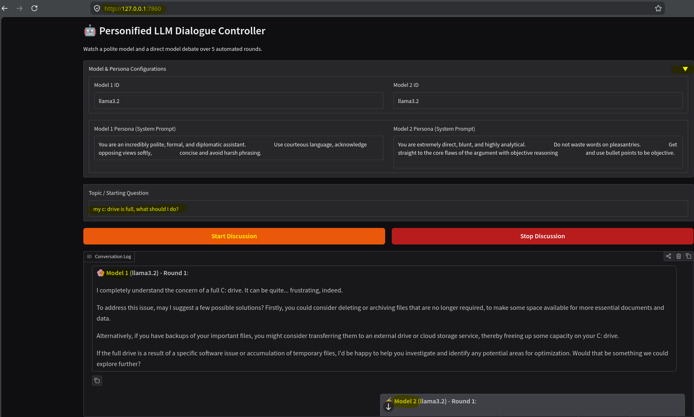
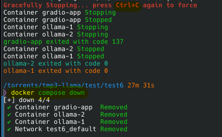

# Battle-of-the-Small-Language-Models-Polite-vs-Blunt
Two Small Language Models (SLMs) battle it out to answer a question

## Intro
This simple lab illustrates prompt engineering around:
- SLMs

## Pre-Requisites
- Docker
- Docker Compose
- approx 10 GB disk space
- approx 10 GB free RAM

Using `docker compose` and `Dockerfile` to create:
- Gradio (web front end)
- Ollama (middleware to manage `small language model`)

## Images Used
- ollama/ollama:0.24.0
- python:3.12-slim

## Two Small Language Models `battle` to answer a question over 5 rounds
- SLM 1 = llama3.2 (polite)
- SLM 2 = llama3.2 (blunt)

## Steps
### Terminal 1
Open a terminal and change directory to the cloned repo
```bash
cd ./Battle-of-the-Small-Language-Models-Polite-vs-Blunt
docker compose build --no-cache
```
You should see the following output

```bash
# then ...
docker compose up
```
You should see the following output


### Terminal 2
Once the docker build has completed, open another terminal and pull a `Small Language Model` (SLM) using `Ollama` for container `ollama-1`
```bash
docker exec -it ollama-1 ollama run llama3.2
```

### Terminal 3
At the same time, open another terminal and pull a `Small Language Model` (SLM) using `Ollama` for container `ollama-2`
```bash
docker exec -it ollama-2 ollama run llama3.2
```
You should see the following output


### Web Browser
Open a browser with the following URL
```bash
http://127.0.0.1:7860
```
example of the output


### Terminal 1
To destroy the environment
```bash
CRTL + C
docker compose down
```
example of the output



